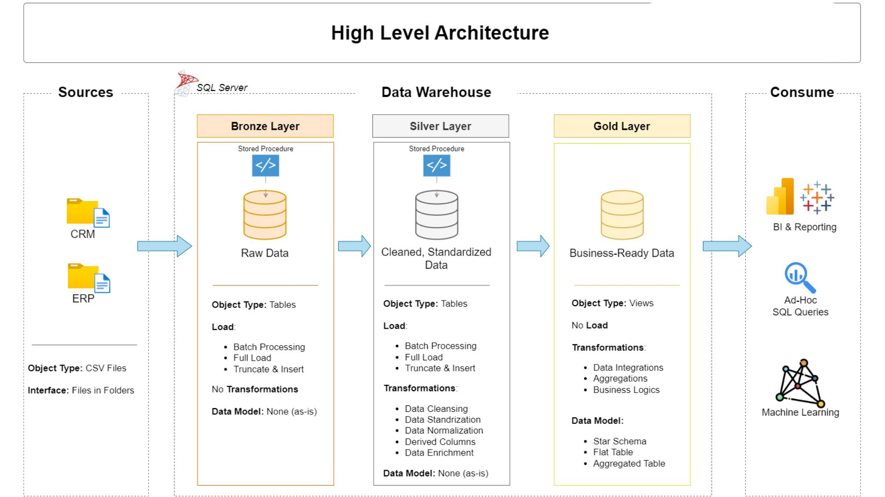

# SQL Data Warehouse and Analytics Project

Welcome to the **Data Warehouse & Analytics Project** repository! 🚀  
This project demonstrates an end-to-end data solution, covering both **Data Engineering** and **Data Analytics** using Microsoft SQL Server.

Starting with raw data from multiple source systems, I designed and built a modern data warehouse using the **Medallion Architecture (Bronze, Silver, Gold)**. On top of the curated Gold layer, I performed **Exploratory Data Analysis (EDA)**, advanced analytical techniques, and created business-ready SQL reports to generate actionable insights.

Designed as a portfolio project, this repository demonstrates practical SQL skills, data modeling, ETL development, analytical thinking, and business reporting.

---
## 🏗️ Data Architecture

The data architecture for this project follows **Medallion Architecture** **Bronze**, **Silver**, and **Gold** layers:

1. **Bronze Layer**: Stores raw data as-is from the source systems. Data is ingested from CSV Files into SQL Server Database.
2. **Silver Layer**: This layer includes data cleansing, standardization, and normalization processes to prepare data for analysis.
3. **Gold Layer**: Houses business-ready data modeled into a star schema required for reporting and analytics.

---
# 📖 Project Overview

The project is divided into two major phases.

## Phase 1 – Data Engineering

Designed and implemented a modern SQL Data Warehouse by:

- Designing the Medallion Architecture
- Building ETL pipelines
- Importing ERP & CRM data
- Cleaning and transforming data
- Creating dimension and fact tables
- Developing a Star Schema
- Preparing analytics-ready datasets

---

## Phase 2 – Data Analytics

Performed SQL-based analysis using the Gold Layer to answer business questions.

The analytics workflow includes:

### Exploratory Data Analysis (EDA)

- Database Exploration
- Dimensions Exploration
- Date Exploration
- Measures Exploration
- Magnitude Analysis
- Ranking Analysis

### Advanced Analytics

- Change Over Time Analysis
- Cumulative Analysis
- Performance Analysis
- Part-to-Whole Analysis
- Customer Segmentation
- Product Reporting
- Customer Reporting

These analyses transform raw business data into meaningful insights that support data-driven decision-making.

---

## 🚀 Project Requirements

### Building the Data Warehouse (Data Engineering)

#### Objective
Develop a modern data warehouse using SQL Server to consolidate sales data, enabling analytical reporting and informed decision-making.

#### Specifications
- **Data Sources**: Import data from two source systems (ERP and CRM) provided as CSV files.
- **Data Quality**: Cleanse and resolve data quality issues prior to analysis.
- **Integration**: Combine both sources into a single, user-friendly data model designed for analytical queries.
- **Scope**: Focus on the latest dataset only; historization of data is not required.
- **Documentation**: Provide clear documentation of the data model to support both business stakeholders and analytics teams.

### 📊 Analytics Objectives

Using the curated Gold Layer, perform business analysis to:

- Explore and understand the dataset
- Identify trends over time
- Measure business performance
- Analyze customer behavior
- Analyze product performance
- Segment customers
- Rank products and customers
- Generate business-ready reports

---
## 🌟 About Me

Hello everyone, my name is **Mukul Rathore**. I’m an aspiring Data Analyst, and this is my Data Warehouse and Analytics project.
